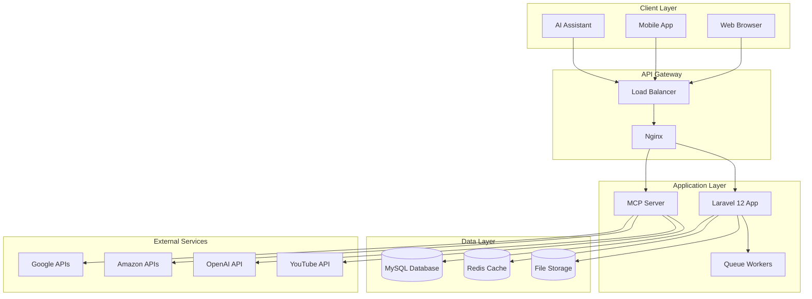
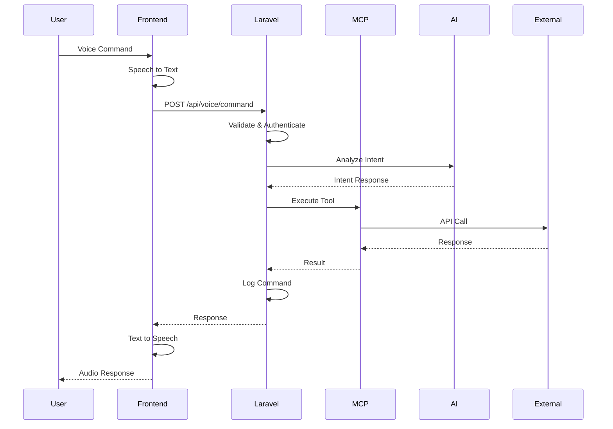
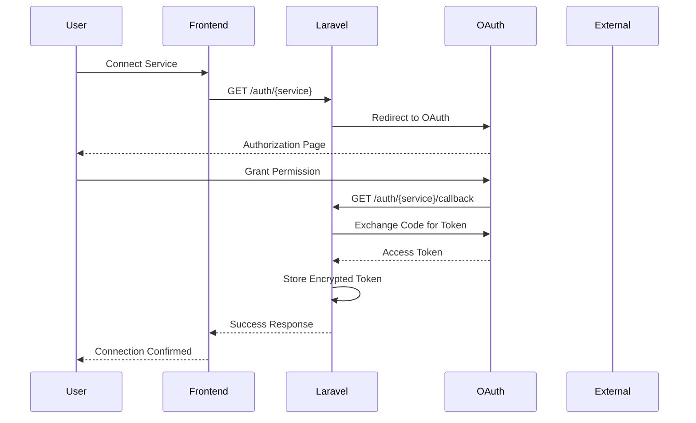
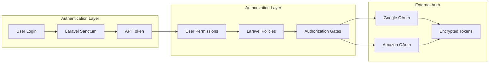
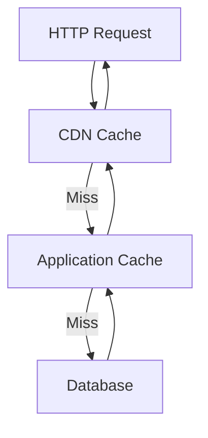
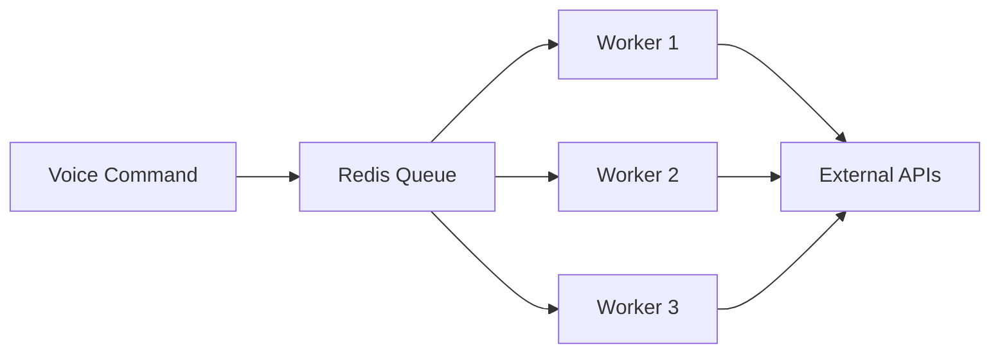
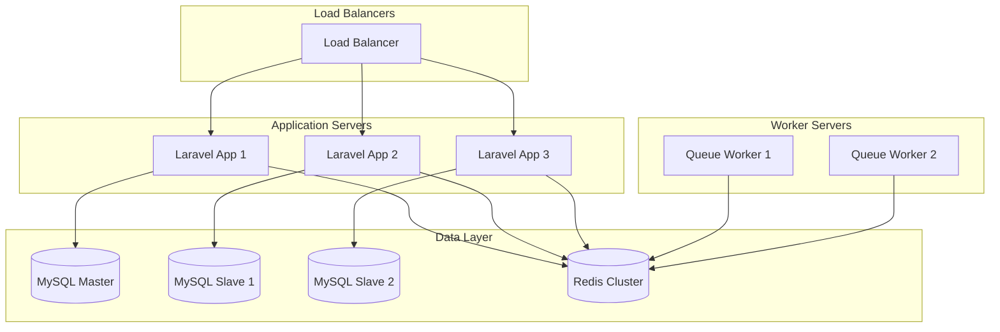
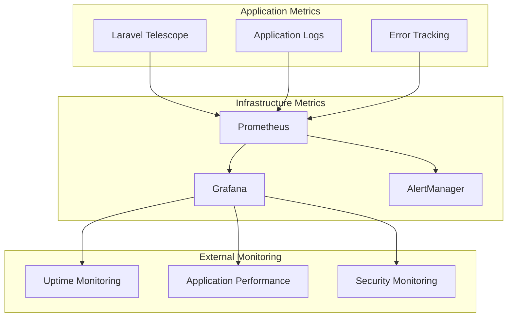
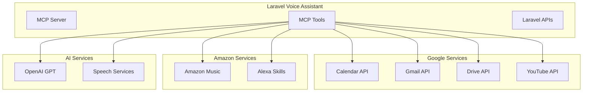
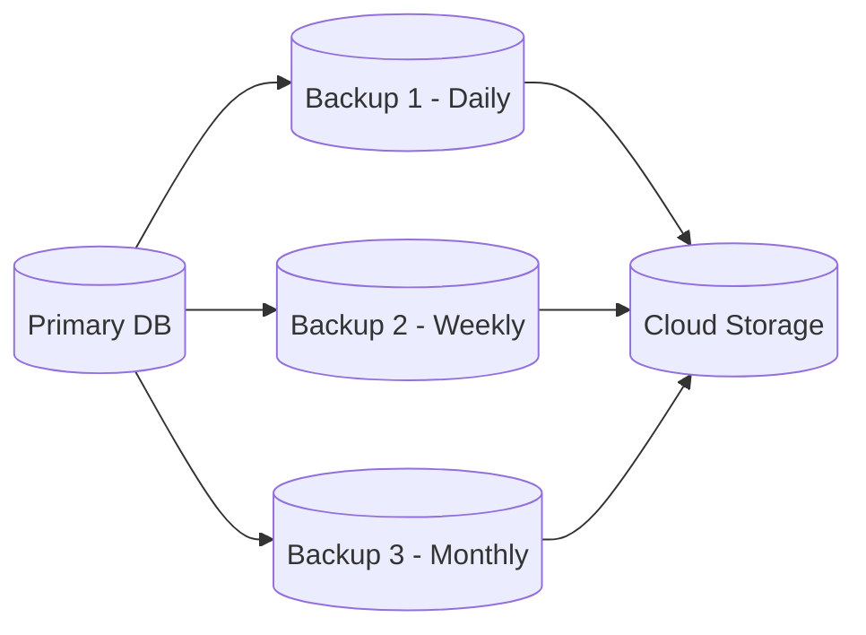

# Laravel Voice Assistant - System Architecture

## Overview

The Laravel Voice Assistant is built using a modern, scalable architecture that leverages the Model Context Protocol (MCP) for AI integration, Laravel 12 for the backend, and a responsive frontend for voice interaction.

## High-Level Architecture



## Component Architecture

### 1. Frontend Layer

#### Web Interface
- **Technology**: HTML5, JavaScript ES2022, Tailwind CSS
- **Voice Recognition**: Web Speech API
- **Real-time Communication**: WebSockets, Server-Sent Events
- **State Management**: Alpine.js
- **Build Tool**: Vite

#### Mobile Interface (Future)
- **Technology**: React Native / Flutter
- **Voice Processing**: Native speech APIs
- **Offline Capability**: Local speech recognition

### 2. Backend Layer

#### Laravel Application
```
app/
├── Http/
│   ├── Controllers/
│   │   ├── Api/          # REST API endpoints
│   │   ├── Auth/         # OAuth controllers
│   │   └── VoiceController.php
│   ├── Middleware/
│   │   ├── VoiceAuthMiddleware.php
│   │   └── McpThrottleMiddleware.php
│   └── Requests/         # Form validation
├── Services/
│   ├── VoiceProcessingService.php
│   ├── GoogleApiService.php
│   ├── AmazonApiService.php
│   └── TokenService.php
├── Models/
│   ├── User.php
│   ├── VoiceCommand.php
│   ├── ServiceToken.php
│   └── Workflow.php
├── Jobs/
│   ├── ProcessVoiceCommandJob.php
│   ├── RefreshTokenJob.php
│   └── SyncExternalDataJob.php
└── Events/
    ├── VoiceCommandProcessed.php
    └── ServiceConnected.php
```

#### MCP (Model Context Protocol) Layer
```
app/Mcp/
├── Servers/
│   └── VoiceAssistantServer.php
├── Tools/                # Executable functions
│   ├── GoogleCalendarTool.php
│   ├── GmailTool.php
│   ├── YouTubeTool.php
│   ├── AmazonMusicTool.php
│   └── VoiceCommandTool.php
├── Resources/            # Data access
│   ├── UserPreferencesResource.php
│   ├── ServiceStatusResource.php
│   └── CommandHistoryResource.php
└── Prompts/             # AI templates
    ├── VoiceAssistantPrompt.php
    └── ServiceIntegrationPrompt.php
```

### 3. Data Layer

#### Database Schema (MySQL)
```sql
-- Users and Authentication
users
service_tokens
password_reset_tokens
sessions

-- Voice Processing
voice_commands
workflows
command_history

-- External Data Sync
google_calendar_events
gmail_messages
youtube_playlists
amazon_music_playlists

-- System
jobs
failed_jobs
notifications
cache
```

#### Caching Strategy (Redis)
```
voice:settings:{user_id}     # User voice preferences
api:tokens:{service}:{user}  # Service access tokens
calendar:events:{user}:{date} # Cached calendar events
email:messages:{user}:{page}  # Cached email messages
youtube:search:{query}       # YouTube search results
rateLimits:{endpoint}:{user} # Rate limiting counters
```

## Data Flow Architecture

### Voice Command Processing Flow



### OAuth Integration Flow



## Security Architecture

### Authentication & Authorization



### Security Layers

1. **Transport Security**
   - HTTPS/TLS 1.3 for all communications
   - Certificate pinning for mobile apps
   - HSTS headers for web browsers

2. **Application Security**
   - Laravel Sanctum for API authentication
   - CSRF protection for web forms
   - XSS protection with Content Security Policy
   - SQL injection prevention with Eloquent ORM

3. **Data Security**
   - Encrypted storage for OAuth tokens
   - Database encryption at rest
   - Secure key management with Laravel encryption
   - PII data anonymization

4. **API Security**
   - Rate limiting per user and endpoint
   - Input validation and sanitization
   - OAuth 2.1 for third-party integrations
   - API versioning for backward compatibility

## Performance Architecture

### Caching Strategy



### Queue Processing



### Performance Optimizations

1. **Database Optimization**
   - Indexed queries for voice commands
   - Database connection pooling
   - Read/write splitting
   - Query optimization and monitoring

2. **Cache Optimization**
   - Redis for session storage
   - Application-level caching
   - API response caching
   - CDN for static assets

3. **Queue Processing**
   - Asynchronous voice processing
   - Background token refresh
   - Batch API calls
   - Failed job retry logic

## Scalability Architecture

### Horizontal Scaling



### Auto-Scaling Configuration

```yaml
# Docker Compose scaling
services:
  laravel-app:
    replicas: 3
    deploy:
      resources:
        limits:
          memory: 512M
        reservations:
          memory: 256M
      update_config:
        parallelism: 1
        delay: 10s
      restart_policy:
        condition: on-failure
```

## Deployment Architecture

### Container Architecture

```dockerfile
# Multi-stage Dockerfile
FROM php:8.3-fpm as base
# Base image with PHP and extensions

FROM base as dependencies
# Install Composer dependencies

FROM dependencies as assets
# Build frontend assets

FROM base as production
# Final production image
```

### Infrastructure as Code

```yaml
# Kubernetes Deployment
apiVersion: apps/v1
kind: Deployment
metadata:
  name: laravel-voice-assistant
spec:
  replicas: 3
  selector:
    matchLabels:
      app: laravel-voice-assistant
  template:
    metadata:
      labels:
        app: laravel-voice-assistant
    spec:
      containers:
      - name: laravel
        image: laravel-voice-assistant:latest
        ports:
        - containerPort: 9000
        env:
        - name: APP_ENV
          value: "production"
        - name: DB_CONNECTION
          value: "mysql"
```

### Monitoring & Observability



## Integration Architecture

### External Service Integration



### API Rate Limiting Strategy

```php
// Rate limiting configuration
'api' => [
    'google' => [
        'calendar' => 1000, // per hour
        'gmail' => 250,     // per minute
    ],
    'youtube' => 10000,     // per day
    'amazon' => 100,        // per minute
    'openai' => 60,         // per minute
],
```

## Disaster Recovery Architecture

### Backup Strategy



### High Availability Setup

1. **Database Replication**
   - Master-slave MySQL setup
   - Automatic failover
   - Point-in-time recovery

2. **Application Redundancy**
   - Multiple application instances
   - Load balancer health checks
   - Graceful degradation

3. **Cache Resilience**
   - Redis cluster mode
   - Automatic failover
   - Data persistence

## Development Architecture

### Development Environment

```yaml
# docker-compose.yml
version: '3.8'
services:
  laravel:
    build: .
    volumes:
      - .:/var/www
    ports:
      - "8000:8000"
    depends_on:
      - mysql
      - redis
  
  mysql:
    image: mysql:8.0
    environment:
      MYSQL_DATABASE: voice_assistant
      MYSQL_ROOT_PASSWORD: password
    ports:
      - "3306:3306"
  
  redis:
    image: redis:7-alpine
    ports:
      - "6379:6379"
```

### CI/CD Pipeline

```yaml
# GitHub Actions
name: CI/CD Pipeline
on:
  push:
    branches: [main]
  pull_request:
    branches: [main]

jobs:
  test:
    runs-on: ubuntu-latest
    steps:
      - uses: actions/checkout@v3
      - name: Setup PHP
        uses: shivammathur/setup-php@v2
      - name: Install dependencies
        run: composer install
      - name: Run tests
        run: php artisan test
  
  deploy:
    needs: test
    runs-on: ubuntu-latest
    if: github.ref == 'refs/heads/main'
    steps:
      - name: Deploy to production
        run: ./deploy.sh
```

---

**Version**: 1.0  
**Last Updated**: September 22, 2025  
**Architecture**: Microservices with MCP Integration